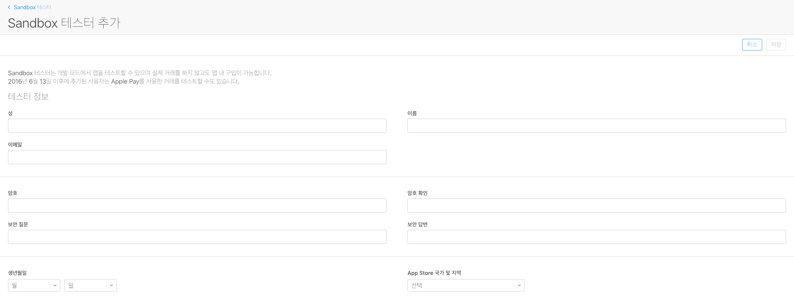

# In-App Purchase 정리

최근 프로젝트에 인앱 구매 기능을 넣고 추후에 까먹을까봐 정리를 하려고한다.

먼저 인앱 기능을 넣고 싶은 프로젝트를 실행해서 Target > Capabillities 속성으로 이동한다.

OFF > ON으로 변경하면 이제부터 이 프로젝트에서는 인앱을 사용할 수 있다.

 그리고 애플 개발자 사이트에서 Certificates, Identifiers & Profiles로 이동한다.

좌측 메뉴에서 Identifiers > App IDs에서 현재 인앱을 ON시킨 프로젝트의 번들 아이디 값과 동일한

App IDs를 가진 프로젝트의 정보를 확인한다.

해당 프로젝트의 In-App Purchase 항목이 Enable로 되어 있으면 기본 설정은 끝났다.

 

 

# In-App Source 구현

먼저 인앱을 구현하기 위해서는 StoreKit이라는 iOS SDK를 이용해야 한다.

Target > Build Phases으로 이동해서 StoreKit Framework 라이브러리를 링크 시킨다.

**InAppViewController.h**

~~~~objc
@interface InAppViewController : UIViewController<
SKProductsRequestDelegate,SKPaymentTransactionObserver> {
    SKProductsRequest *productsRequest;
    NSArray *validProducts;
    IBOutlet UILabel *productTitleLabel;
    IBOutlet UILabel *productDescriptionLabel;
    IBOutlet UILabel *productPriceLabel;
    IBOutlet UIButton *purchaseButton;
    IBOutlet UIButton *restorePurchaseButton;
}

- (void)fetchAvailableProducts;
- (BOOL)canMakePurchases;
- (void)purchaseMyProduct:(SKProduct*)product;
- (IBAction)purchase:(id)sender;
~~~~

 

**InAppViewController.m**

~~~~objc
#import <StoreKit/StoreKit.h>
#define kTutorialPointProductID @"com.leby.Memories.InApp"
~~~~

> kTutorialPointProductID는 이 시점에서는 모른다. 
>
> Source 구현이 끝나고 itunesconnect 에서 ProductID를 지정해주어야 한다.

~~~~objc
- (void)viewDidLoad {
    [super viewDidLoad];
    // Do any additional setup after loading the view.
    [self fetchAvailableProducts];
}
~~~~

~~~~objc
-(void)fetchAvailableProducts {
    NSSet *productIdentifiers = [NSSet setWithObjects:kTutorialPointProductID,nil];
    productsRequest = [[SKProductsRequest alloc] initWithProductIdentifiers:productIdentifiers];
    productsRequest.delegate = self;
    [productsRequest start];
}
~~~~

~~~~objc
- (BOOL)canMakePurchases {
    return [SKPaymentQueue canMakePayments];
}
~~~~

~~~~objc
- (void)purchaseMyProduct:(SKProduct*)product {
    if ([self canMakePurchases]) {
        SKPayment *payment = [SKPayment paymentWithProduct:product];
        [[SKPaymentQueue defaultQueue] addTransactionObserver:self];
        [[SKPaymentQueue defaultQueue] addPayment:payment];
    } else {
//        NSLog(@"Purchases are disabled in your device");
        [Utils showToastErrorWithTitle:@"Error" message:@"Purchases are disabled in your device" duration:1.5];
        purchaseButton.hidden = YES;
        restorePurchaseButton.hidden = YES;
    }
}
~~~~

~~~objc
#pragma mark StoreKit Delegate
-(void)paymentQueue:(SKPaymentQueue *)queue updatedTransactions:(NSArray *)transactions {
    for (SKPaymentTransaction *transaction in transactions) {
        switch (transaction.transactionState) {
            case SKPaymentTransactionStatePurchasing:
//                NSLog(@"Purchasing");
                break;
                
            case SKPaymentTransactionStatePurchased:
                if ([transaction.payment.productIdentifier isEqualToString:kTutorialPointProductID]) {
//                    NSLog(@"Purchase is completed succesfully");
                    _SET_BOOL_PREFERENCE(_KEY_APP_ADMOB_HIDE, YES);
                    [Utils showToastInfoWithTitle:@"광고 제거" message:@"배너 광고가 삭제되었습니다." duration:1.5];
                    [self.view removeFromSuperview];
                    [[SKPaymentQueue defaultQueue] finishTransaction:transaction];
                }
                break;
                
            case SKPaymentTransactionStateRestored:
//                NSLog(@"Restored ");
                [[SKPaymentQueue defaultQueue] finishTransaction:transaction];
                break;
                
            case SKPaymentTransactionStateFailed:
//                NSLog(@"Purchase failed ");
                break;
                
            default:
                break;
        }
    }
    dispatch_async(dispatch_get_main_queue(), ^{
        [SVProgressHUD dismiss];
    });
}
~~~

~~~objc
-(void)productsRequest:(SKProductsRequest *)request didReceiveResponse:(SKProductsResponse *)response {
    SKProduct *validProduct = nil;
    NSUInteger count = [response.products count];
    
    if (count > 0) {
        validProducts = response.products;
        validProduct = [response.products objectAtIndex:0];
        
        if ([validProduct.productIdentifier
             isEqualToString:kTutorialPointProductID]) {
            [productTitleLabel setText:validProduct.localizedTitle];
            [productDescriptionLabel setText:validProduct.localizedDescription];
            NSString *priceString = [NSString stringWithFormat:@"구매 ($%@)",validProduct.price];
            [purchaseButton setTitle:priceString forState:UIControlStateNormal];
        }
    } else {
        // 아이튠즈커넥트에서 계약 및 세금 금융 거래 항목을 작성하지 않아 발생됐음.
//        NSLog(@"No products to purchase");
        [Utils showToastErrorWithTitle:@"Error" message:@"No products to purchase" duration:1.5];
        purchaseButton.hidden = YES;
        restorePurchaseButton.hidden = YES;
    }
    purchaseButton.hidden = NO;
    restorePurchaseButton.hidden = NO;
    
    [SVProgressHUD dismiss];
}
~~~

~~~objc
#pragma mark - 버튼 메서드
-(IBAction)purchase:(id)sender {
    dispatch_async(dispatch_get_main_queue(), ^{
        [SVProgressHUD show];
    });
    
    if (sender == restorePurchaseButton) {
        [Utils showToastInfoWithTitle:@"인앱 알림" message:@"구매내역이 있으시면 구입 눌러도\n추가 금액이 발생하지 않습니다." duration:3];
    }
    
    if (self->validProducts != nil) {
        [self purchaseMyProduct:[self->validProducts objectAtIndex:0]];
    }
}
~~~

 

 

# 인앱 제품 추가

이번에는 인앱 상품을 추가한다. itunesconnect 인앱을 추가 시킬 앱으로 이동한다.

나의 앱 > 앱 내 추가 기능 > 앱 내 구입 항목으로 이동한다.

> 나의 앱
>
> > 앱 내 추가 기능
> >
> > > 앱 내 구입

위치로 이동해서 +버튼을 눌러 새로운 상품을 등록한다.

인앱 상품에는 2018.06.07 현재는 총 4가지의 상품이 있다.

- **소모품** (낚시 앱의 물고기 떡밥)
- **비소모품** (게임 앱의 레이스 트랙)
- **자동 갱신 구독** (스트리밍 서비스를 지원하는 앱 월간 구독)
- **비자동 갱신 구독** (아카이브된 기사 카탈로그 1년 구독)

위와 같이 4가지가 있다. 나는 여기에서 2번째 비소모품으로 인앱 상품을 구성하였다.

**식별 정보** : com.leby.Memories.InApp (자신의 앱에 맞게 변경하면 됨)

**제품 ID** : 자신이 마음대로 입력하면 됨 (단, 중복되지 않도록)

**가격** : 원하는 가격에 맞게 설정

★ **판매용으로 승인됨** : 이 부분이 체크 되어있는지 확인 필요 (체크 해제 되어있으면 실제 배포시 인앱 기능 X)

**현지화** : 언어를 지원하는 나라에 맞게 제품 설명하는 것을 변경하면 됨.

**스크린샷** : 구매, 구매복원 등의 앱에서 어떤식으로 보여지는지 스크린샷

---------------

각 항목에 맞춰 입력하고 저장을 누르면 제품 등록은 끝이다.

 

 

# 인앱 테스트 계정 추가 (Sandbox 테스터)

인앱 상품에 대해서 구매할 수 있는 테스터 계정을 만들어야 한다.

itunesconnect로 이동해서 사용자 및 역할 > Sandbox 테스터 + 눌러 추가를 해야한다.

> 사용자 및 역할
>
> > Sandbox 테스터

테스트를 진행 할 임의의 이메일 주소를 입력하고 나머지 정보들은 채우면 된다.

근데 여기서 가장 중요한 것은 각각의 조건을 맞추어야 한다.

가끔 애플 페이지가 에러가 나면 별 말 없이 에러가 났다는 문구만 보여준다.

- 암호는 8자에서 32자 사이여야 합니다.
- 보안 질문은 6자에서 35자 사이어야 합니다.
- 보안 답변은 6자에서 35자 사이어야 합니다.
- 해당 이메일 주소는 이미 기존 Apple ID에 연결되어 있습니다.

각 조건에 맞게 작성을 했다면 저장을 눌러 아이디를 생성한다.

 

 

# TestFlight 인앱 테스트

이제 앱을 테스트 TestFlight에 올려 Sandbox 테스터 계정으로 테스트를 할 수 있다.

테스를 진행하다보면 소스 상에서 다음과 같이 에러를 볼 수 있다.

~~~~objc
No products to purchase
~~~~

 

이 부분은 인앱 제품의 대해 정보를 가져오지 못했을 때 발생되는 에러이다.

가져오지 못하는 이유에는 여러가지가 있겠지만, 제가 발생되었던 이슈는 **계약 및 세금 금융 거래** 누락이였다.

인앱 기능을 넣고 판매할 때 입력해야할 필수 항목이다.

인앱을 판매하게되면 일부 수익금을 애플에서부터 받게 된다. 어느 은행이고, 어떤 계좌로 수익금을 받을지를 작성하게 된다.

그래서 **계약 및 세금 금융 거래**가 누락 되었다면 제품을 판매할 수 없는 것이다.

계약 및 세금 금융 거래를 작성을 하시면 정상적으로 인앱 제품이 조회되는 것을 볼 수 있다.

여기까지 했으면 실제 앱을 배포했을 때도 정상적으로 인앱 기능이 동작한다.

 

 

# 앱 배포시 특이사항

인앱 구매에 대해서 앱스토어 리젝이 난 적이 있다. 

3.1.1 In-App Purchase : 기능 제한의 해제에는 사용 필수이며 인앱결제 이외의 결제방법은 불가한다. 구입한 통화는 만기없이 앱내에서만 소비 가능하며 복구기능 및 청구유형이 잘못된 앱은 불가한다. 청구내용의 선물도 불가한다.

**즉, 구매 버튼만 있으면 되는게 아니라, 구매 복구 버튼도 있어야 된다고 한다.**

하지만 나는 구매 복원 버튼이 있고, 눌렀을 때 똑같이 구매 프로세스로 동작하긴 하지만 비밀번호를 입력하면

복원 프로세스를 돌리는 로직으로 구현이 되어있어 스크린샷과 관련 내용을 다시 전달하였다.

 

그렇게 하루가 지나고 iOS에서 앱의 상태를 심사 중으로 변경하고 항목에 대해 확인하고 판매 준비됨으로 상태를 변경해주었다.